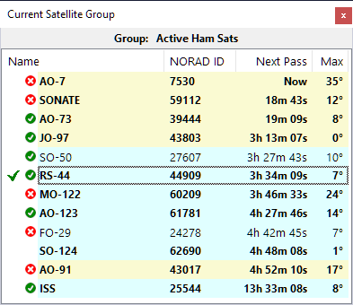

# Download

 

### Current Version

[SkyRoof v.1.15 beta](https://github.com/VE3NEA/SkyRoof/releases/download/v.1.15-beta/SkyRoofSetup-v.1.15-beta.zip)

Anti-virus scan of the file above:
[click here](https://www.virustotal.com/gui/url/e472be78669cbf94eba5788a23bfb783ade89f0137f79c51c43e94b347db1e77).

 

### Previous Versions

See [All Releases](https://github.com/VE3NEA/SkyRoof/releases)

 

### Release Notes

#### v.1.15 Beta

- Adif folder creation fixed.

#### v.1.14 Beta

- QSO Entry panel added;
- Output Stream settings are now applied correctly;
- documentation updated.

#### v.1.13 Beta

- added I/Q and audio streaming via UDP;
- added satellite position announcement.

#### v.1.12 Beta

- fixed the error caused by the decayed satellites;
- installer is signed with an Open Source SignPath certificate.

#### v.1.11 Beta

- added support of HackRF SDR and AirspyHF+;
- reduced toolbar width to fit smaller screens;
- added vertical scale to the Timeline panel;
- fixed null pointer error;
- added more sdr-related logging;
- updated documentation.

#### v.1.10 Beta

- experimental version for debugging SDR interface.

#### v.1.9 Beta

- added command to reset window layout;
- missing DLL files added to the installer.

#### v.1.8 Beta

- added support of RSP1b and RSPdx-R2 SDR;
- improved error handling and logging.

#### v.1.7 Beta

- added a real-time satellite status indicator to the
[Current Group](users_guide/current_group_panel.md) panel. Must be enabled in Settings.

    

#### v.1.6 Beta

- added support of remote SDR;
- added automatic checking for software updates;
- the user is no longer required to enter a Ham callsign;
- re-entered satellites are now removed from the groups to prevent errors.

#### v.1.5 Beta

- added command to load TLE from file;
- added support of RTL-SDR Blog V.4;
- improved handling of non-standard text size.

#### v.1.4 Beta

- added support of azimuth-only rotators;
- fixed overlapped text on the monitors with non-standard text size;
- the waterfall may now work on the low end video cards, with lower spectrum resolution.

#### v.1.3 Beta

- fixed Null Pointer errors;
- fixed the decimal comma vs. decimal point issue.

#### v.1.2 Beta

- waterfall display is now less demanding to the video card capabilities;
- improved logging.

#### v.1.1 Beta

- missing DLL's added to the installer.

#### v.1.0 Beta

- the first public release.
