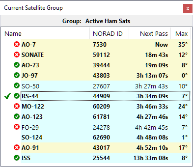

# Download

 

### Current Version

[SkyRoof v.1.53](https://github.com/VE3NEA/SkyRoof/releases/download/v.1.53/SkyRoofSetup-v.1.53.exe)

 

### Previous Versions

See [All Releases](https://github.com/VE3NEA/SkyRoof/releases)

 

### Release Notes

#### v.1.53

- fragments of SSDV/JPEG images are combined across satellite passes
- SSDV/JPEG files with missing fragments are repaired when possible

#### v.1.52

- UTC / Local time switch in the clock now applies to all panels
- transmitters-override.json file updated - TNX Marcus PY2PLL
- error in the Slicer fixed

#### v.1.51

- added signal params discovery to telemetry decoder
- added telemetry and SSTV decoding of terrestrial signals
- fixed satellite data import after upstream format change
- fixed some glitches in the dark theme

#### v.1.50

- dark theme implemented

#### v.1.49

- added support of CTCSS tones

#### v.1.48

- added SSTV image denoising function
- fixed the frequency tuning error

#### v.1.47

- added SSDV decoder
- added CODEC2 voice decoder
- user-selected soundcard for announcements

#### v.1.46

- telemetry decoding supports new framings, Geoscan and AO-40 FEC
- SSTV decoding improved
- alternating telemetry and SSTV transmissions are now decoded

#### v.1.45

- improved SSTV decoding, eliminated long delay in image processing
- added pass selection by max. elevation in satellite auto-selection

#### v.1.44

- a bug fixed in the SDR interface that was crashing the app

#### v.1.43

- added antenna tracking option in satellite auto selection
- SSTV decoding improved
- reduced overflows in SDR streaming

#### v.1.42

- fixed antenna direction indicator
- fixed choppy audio

#### v.1.41

- Current Group list is no longer re-sorted every second
- checkbox repaint in Auto Selection Schedule is fixed

#### v.1.40

- added auto selection of satellites by schedule
- CAT band switching streamlined - contributed by [cozmogeek](https://github.com/cozmogeek)
- improved telemetry decoding

#### v.1.39

- SSTV decoder added
- multiple improvements in telemetry decoding

#### v.1.38

- frame submission to SatNOGS no longer depends on Windows culture

#### v.1.37

- added diagnostics logging for SatNOGS submission
- reduced font size in the Telemetry panel
- saved and restored column widths and splitter positions in all panels
- the Settings window now opens with sections collapsed

#### v.1.36

- Telemetry decoding added
- fixed right-click error in Group Panel

#### v.1.35

- the mode is guessed when a transmitter is selected for the first time
- Doppler correction of the SDR receiver is interpolated instead of changing in steps
- incorrect display of SDR gain on non-English windows is fixed

#### v.1.34

- pass coverage area is now plotted in EarthView
- improved performance of the waterfall - contributed by [cozmogeek](https://github.com/cozmogeek)
- fixed intermittent crashes on saving updated groups

#### v.1.33

- network resilience improvements - contributed by [Stu](https://github.com/shs101)
- labels and tuning commands on the frequency scale now work without an SDR
- fixed mouse clicks on the satellite image

#### v.1.32

- added QSO Scheduler panel
- added support of decimal comma on non-English systems
- fixed item drawing in Passes panel
- audio recording file names now contain recording start time

#### v.1.31

- added satellite image panel on the toolbar - contributed by [cozmogeek](https://github.com/cozmogeek)
- reduced the minimum antenna tracking step to 0.01°

#### v.1.30

- added support of transverter offset

#### v.1.29

- no changes, version bumped to rebuild

#### v.1.28

- setup program updated to auto install .NET10 runtime if not present
- Recorder panel added

#### v.1.27

- fixed decimal format in the rotator control command
- mode set to MFSK for FT4 contacts in the ADIF file
- squelch option save/restore fixed
- updated satellite status retrieval to work with new AMSAT format
- added antenna parting option
- fixed error when selected transmitter is no longer in the database

#### v.1.26

- added TX Gain slider to the FT4 Console panel;
- added the Log button in the FT4 Console panel;
- added commands to the context menu in the FT4 Console panel.

#### v.1.25

- added FT4 Console;
- added a work around a Wine 9 bug;
- fixed announcement cutoff on Windows 11;
- added an option to disable FM Squelch;
- reduced audio drop-outs;
- removed support of PlutoSDR (its dll breaks detection of other SDR's).

#### v.1.24

- work around the errors in the JE9PEL satellite list;
- lower case band names used in the ADIF file;
- SSB passband shifted relative to the suppressed carrier.

#### v.1.23

- the DUAL_WATCH command is no longer sent to rigctld.exe;
- improved error handling for antenna rotator.

#### v.1.22 FINAL RELEASE

- implemented the Smart Antenna Rotation algorithm;
- satellite pass details added to the mouse tooltip;
- satellites without transmitters removed from the dataset;
- fixed ADIF generation error.

#### v.1.21 RC

- many improvements in the CAT control;
- improved integration with SkyCAT;
- STATION_CALLSIGN and GRIDSQUARE added to ADIF output;
- the Alt key increases the mouse-wheel tuning speed.

#### v.1.20 Beta

- improved error handling;
- fixed minor errors.

#### v.1.19 Beta

- fixed a number of glitches in the CAT control.

#### v.1.18 Beta

- fixed the Transmit button;
- improved stability of CAT control;
- added a drop-down menu to Rotator on the status bar.

#### v.1.17 Beta

- FM_D mode added for external decoders;
- documentation updated.

#### v.1.16 Beta

- Added support of PlutoSDR;
- added Notes to the QSO Entry panel;
- documentation updated.

#### v.1.15 Beta

- Adif folder creation fixed.

#### v.1.14 Beta

- QSO Entry panel added;
- Output Stream settings are now applied correctly;
- documentation updated.

#### v.1.13 Beta

- added I/Q and audio streaming via UDP;
- added satellite position announcement.

#### v.1.12 Beta

- fixed the error caused by the decayed satellites;
- installer is signed with an Open Source SignPath certificate.

#### v.1.11 Beta

- added support of HackRF SDR and AirspyHF+;
- reduced toolbar width to fit smaller screens;
- added vertical scale to the Timeline panel;
- fixed null pointer error;
- added more sdr-related logging;
- updated documentation.

#### v.1.10 Beta

- experimental version for debugging SDR interface.

#### v.1.9 Beta

- added command to reset window layout;
- missing DLL files added to the installer.

#### v.1.8 Beta

- added support of RSP1b and RSPdx-R2 SDR;
- improved error handling and logging.

#### v.1.7 Beta

- added a real-time satellite status indicator to the
[Current Group](users_guide/current_group_panel.md) panel. Must be enabled in Settings.

    

#### v.1.6 Beta

- added support of remote SDR;
- added automatic checking for software updates;
- the user is no longer required to enter a Ham callsign;
- re-entered satellites are now removed from the groups to prevent errors.

#### v.1.5 Beta

- added command to load TLE from file;
- added support of RTL-SDR Blog V.4;
- improved handling of non-standard text size.

#### v.1.4 Beta

- added support of azimuth-only rotators;
- fixed overlapped text on the monitors with non-standard text size;
- the waterfall may now work on the low end video cards, with lower spectrum resolution.

#### v.1.3 Beta

- fixed Null Pointer errors;
- fixed the decimal comma vs. decimal point issue.

#### v.1.2 Beta

- waterfall display is now less demanding to the video card capabilities;
- improved logging.

#### v.1.1 Beta

- missing DLL's added to the installer.

#### v.1.0 Beta

- the first public release.
