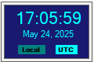

# Clock

The **Clock** widget at the right end of the toolbar shows the current time and date, and selects the
time zone in which SkyRoof displays times:

The two small labels at the bottom of the widget, **Local** and **UTC**, show which mode is active: the
selected one is highlighted in bright aqua, the other one in dark teal. Click either label, or the time
display itself, to switch between the two modes. The selected mode is saved when the program closes and
restored the next time it starts.

## What The Mode Affects

The setting is application-wide: every wall-clock time in the program is displayed in the selected zone,
and all panels update immediately when the mode is switched.

Displayed times are marked with the zone they are in: **Z** for UTC and **LT** for local time.

## What Does Not Change

A few times are tied to a particular zone by their purpose, and are not affected by this setting:

- the **UTC** field of the [QSO Entry](qso_entry_panel.md) panel is always in UTC, as required by the
  ADIF format;
- the slot times in the [FT4 Console](ft4_console_panel.md) panel are always in UTC, marked with **Z**,
  because the FT4 time slots themselves are aligned to UTC;
- the names of the files that SkyRoof saves, such as the recordings and the decoded images and voice
  messages, are always built from the local time.