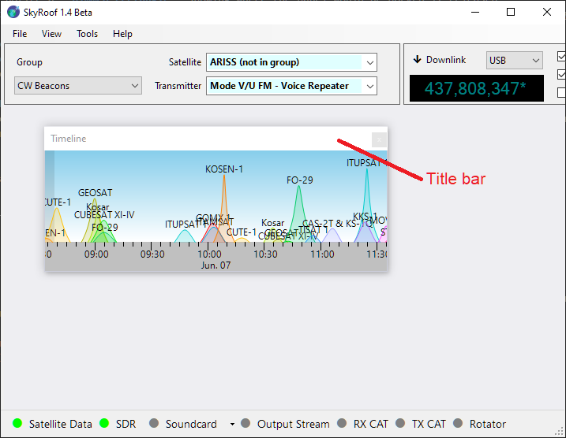
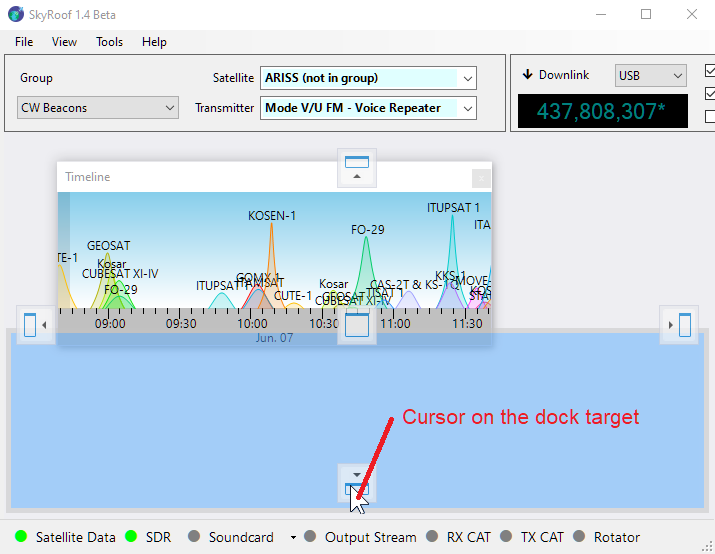
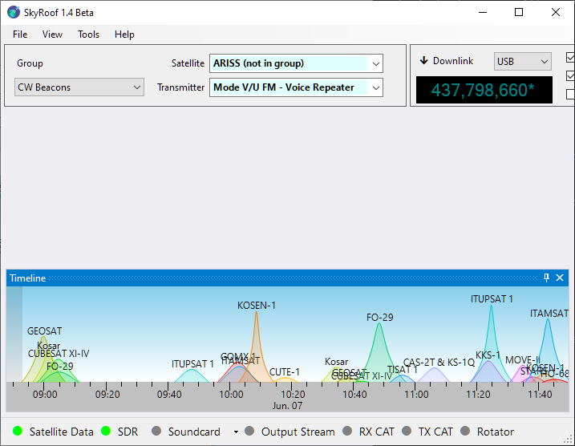
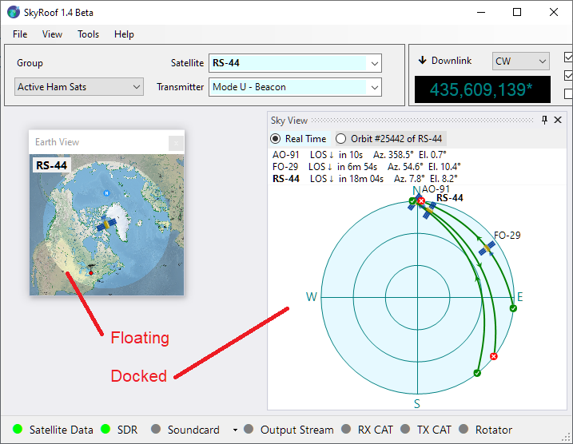
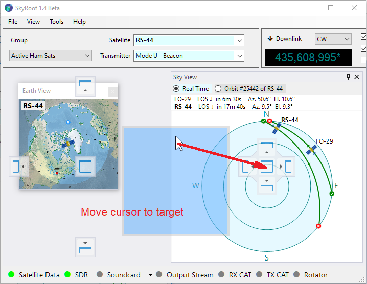
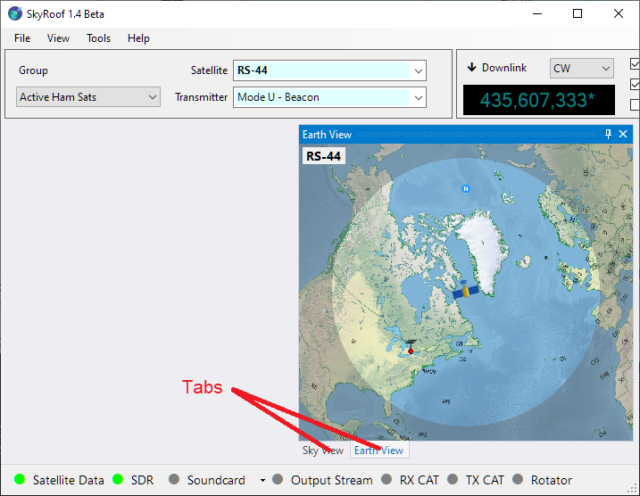

# Configuring the Window Layout

The layout of SkyRoof's main window is under your full control. Any panel may be shown or hidden,
docked anywhere in the window, or left floating.

## Show and Hide

Show the panels using the menu commands in the **View** section, hide them using the same command again, or by clicking on the
Close button on panel's caption bar.

## Docking

The panels you open are initially in the floating state. This is not very convenient as you cannot move or resize the
main window without breaking your panel arrangement. You can dock the panels so that they move and resize when you move/resize the main window.

### How to Dock a Floating Panel

The [Timeline](time_line_panel.md) panel in the screenshot below is floating. Let us dock it to the bottom of the main window.

1. **Find the Panel's Title Bar**

    Locate the top bar of the floating panel labeled *"Timeline"*. This is known as the **title bar**.

    

2. **Click and Hold**  
   Move your mouse cursor to the title bar and press the **left mouse button**. Keep holding the button down.

3. **Drag the Panel**  
   While holding the mouse button, move the panel by dragging it with the mouse. As you begin to drag, you will see **dock target icons** appear in the main window—these icons represent the available docking positions.  
   You will also notice a **dimmed rectangle** showing where the panel would be docked if released.  
   > ⚠️ **Important:** This rectangle is only a visual preview. Do **not** try to align it with the dock target icon. Instead, focus on where your mouse cursor is.

    

4. **Position the Mouse Cursor Over a Dock Target Icon**  
   Move your **mouse cursor** over one of the dock target icons (not the rectangle). The docking location will update automatically. The panel will only dock if the cursor is directly over the icon.

    

5. **Release to Dock**  
   Once the cursor is over your desired dock target icon, **release the mouse button**. The panel will snap into place — either at the side, in the center, or nested inside another panel, depending on the selected icon. Once docked, the panel becomes part of the main window layout, helping keep your workspace clean and organized.

    

## Auto-Hide

A panel can be switched to the **auto-hide mode**, which allows it to stay hidden until you click on its tab.
In the screenshot below, notice the **"Timeline" tab** in the bottom-left corner. Clicking this tab temporarily slides the **Timeline** panel into view.
To enable auto-hide mode, click the **Auto-Hide** button    located on the panel’s title bar.

## Tabbing

You can also organize panels as **tabs**.

If you drop one panel directly onto another, they will be grouped into a tabbed interface.

In the screenshot below the
[Sky View Panel](sky_view_panel.md) and [Earth View Panel](earth_view_panel.md)
have been combined into a tabbed view.
You can switch between these panels by clicking on their respective tabs.

