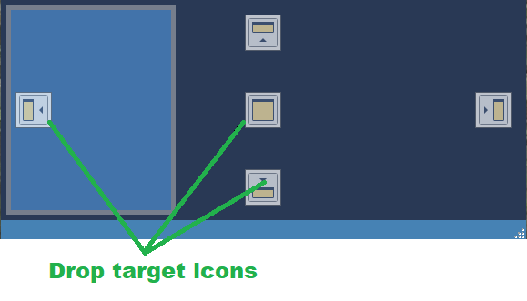

# Configuring the Window Layout

The layout of SkyRoof's main window is under your full control. Any panel may be shown or hidden,
docked anywhere in the window, or left floating.

## Show and Hide

Show the panels using the menu commands in the **View** section, hide them using the same command again, or by clicking on the
Close button on panel's caption bar.

### Dock

To dock the panel, start dragging it by its caption bar. When the dragging starts, the drop target icons appear in the places where
the panel may be docked:

Drop the panel on one of such icons. Drop it anywhere else to leave it floating.

## Central Area

The central area of the window is usually occupied with the waterfall display. If you are not using an SDR and thus do not have
a waterfall, you may want to use that area for something else, e.g., the
[Earth View Panel](earth_view_panel.md)
and
[Sky View Panel](sky_view_panel.md):

 

Note that the frequency scale is useful even without an SDR, in this case it could be docked at the bottom.

## Auto-Hide

A panel may be switched to the auto-hide mode so that it does not occupy any space until you click on its tab:

Note the "Waterfall" tab in the bottom left corner of the screenshot above: when you click on it, the Waterfall panel
temporarily slides into view. To enable auto-hide, click on the Auto-Hide button
 on the caption bar.

## Tabbing

If you drop one panel over the other, they become tabbed, as
[Satellite Details Panel](satellite_details_panel.md)
and
[Satellite Transmitters panel](satellite_transmitters_panel.md)
in the screenshot below:

Now you can switch between the panels by clicking on their tabs.
