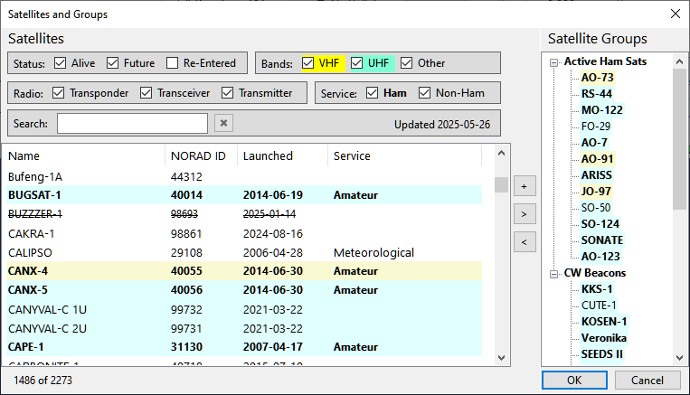

# Creating Satellite Groups

SkyRoof comes with two pre-defined groups of satellites created for your convenience, **Active Ham Sats** and **CW Beacons**. 
The first group
lists the satellites carrying the linear transponders, FM repeaters or digital systems that were available to Hams
at the time of this writing. The second group includes the satellites that send beacon signals or telemetry in Morse Code,
or just transmit an unmodulated carrier (a.k.a. Continuous Wave, CW). Most likely, you will want to modify or delete these groups
and add your own ones. Here is how to do this.

Click on **Tools / Satellites and Groups** in the main menu to open the **Satellites and Groups window**:

The left panel lists
[all satellites](satellite_data.md)
known to SkyRoof, the right panel shows the groups.

- to create a group, click on the **[+]** button, then enter the group name;
- to add a satellite to the group, drag it from the satellite list onto the group, or click on the **[>]** button;
- to delete a group, or a satellite from the group, select it in the right panel and press the Delete key,
  or click on the **[<]** button.
- click on OK to save the changes.

 

The **Satellites and Groups window** has many commands to filter and search satellites, to rename them, and to view
detailed information about the satellites and their transmitters. These commands are described in the
[Satellites and Groups Window](satellites_and_groups_window.md) section of this document.
