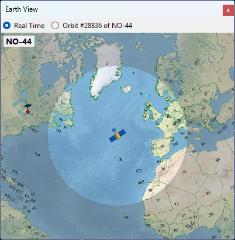
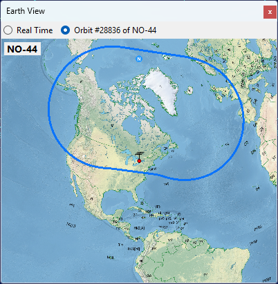
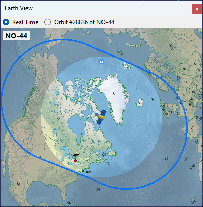

# Earth View

The Earth View panel shows the view of the Earth from the satellite. Use the radio buttons at the top of the panel to switch between two modes:

- **Real Time** centers the view on the satellite and highlights the area it can see at this moment.
- **Selected Pass** centers the view on your station and draws the coverage contour of the currently selected pass.

Use the mouse wheel to zoom the view in and out.

## Real Time

The highlighted area is what the satellite can see from its current position.
 
The satellite is above the horizon for the observers located in this area.

## Selected Pass

The blue contour outlines the entire area swept by the satellite footprint during the pass. Any observer inside this contour will have the satellite above the horizon at some point during the pass.

While the pass is in progress, the panel switches back to Real Time mode so you can watch the satellite move across its coverage area:

