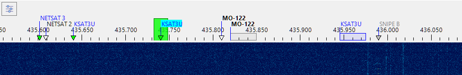
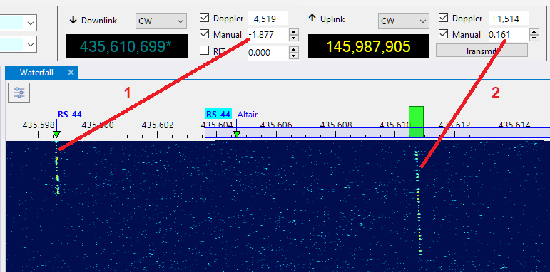

# Frequency Scale

The frequency scale appears on the
[Waterfall Display](waterfall_display.md) panel, above the waterfall:

## Satellite Transmitters

The Doppler-corrected frequencies of the satellite transmitters are marked on the frequency scale
with small triangles, labeled with the satellite names:

- **green triangles** - the satellites that are currently above the horizon;
- **white triangles** - the satellites that will rise in the next 5 minutes;
- **gray triangles** - the satellites that are already below the horizon, but whose signals are still
    may be visible on the waterfall;

 

- **blue rectangles** - the transponder segments of the satellites above the horizon;
- **gray rectangles** - the transponder segments of the satellites below the horizon.

The names of the satellites that belong to the current group are shown in bold;

The current transmitter has its satellite name on the light blue background.

Move the mouse cursor over a satellite name to see the details on the mouse tooltip.

Right-click on a satellite name to open the popup menu with these commands:

- **Select Transmitter** - if the satellite has more than one transmitter on the same frequency,
    this command is enabled and allows you to set one of the transmitters as selected;
- **Add to Group** - add the satellite to one of the existing groups;
- **Report to AMSAT** - open the dialog to report your observation of this satellite
    to [AMSAT Live OSCAR Satellite Status Page](https://www.amsat.org/status/)

    

- **Satellite Details** - opens the [Satellite Details window](satellite_details_window.md)

The frequency scale does not show all satellites at all times, only those that are currently available at your location. The satellite labels appear about 5 minutes before the AOS, and stay for a while after LOS, so that the existing signal traces could be identified, but then they disappear. This also applies to the linear satellites and their transponder segments. When the segment is not visible, you cannot tune within it using the mouse controls. The operator tunes in the transponder segment to tune to some station, or to find a clear space to send CQ. If the satellite is below the horizon, this, of course, cannot be done, and if you are still using the tuning commands, the program assumes that you are trying to do something else, e.g., tune to a terrestrial signal.

## SDR Receiver

The passband of the SDR receiver is shown on the frequency scale as a green rectangle.
To tune the receiver:

- click on one of the satellite labels to start tracking satellite's transmitter;
- click within a blue transponder segment to select the transmitter and set the transponder offset;
- click anywhere on the frequency scale to tune to a terrestrial signal;
- drag the green rectangle to another frequency with a mouse;
- spin the mouse wheel on or near the green rectangle.

The effect of tuning depends on the transmitter selection:

- when tuned to a terrestrial signal, tuning the SDR receiver just changes the receiver frequency;
- when a satellite transmitter is tracked, tuning adjusts the **Manual Offset** of the satellite
    (see below);
- if a satellite transponder is selected, tuning changes the receiver offset within the
    transponder segment.

Another way to tune the SDR receiver is to use the
[Frequency Control](frequency_control.md)
on the toolbar.

If [RX CAT](setting_up_cat_control.md)
is enabled, tuning the SDR receiver also tunes the external radio to the same frequency.

> [!NOTE]
> Get a mouse with a free-spinning wheel, such as Logitech MX Master 3S, this makes tuning
> much easier.
>
> 

## Manual Offset

The Manual Offset setting compensates for the transmitter frequency error, see
[Frequency Control](frequency_control.md) and [Doppler Tracking](doppler_tracking.md) for details.

The offset value is usually the same for all transmitters of a satellite, adjust it for some
non-transponder transmitter before using the transponder. Most satellites with a transponder also
carry a telemetry or beacon transmitter that you can use to set the manual offset:

## Aligning The Uplink and Downlink Frequencies

The screenshot below shows how to set Manual Correction for the uplink and downlink for a linear transponder, such as RS-44.

1. Select the beacon transmitter of the satellite and adjust the Downlink Manual Correction setting to align the transmitter label
and its signal trace on the waterfall. For RS-44 the required correction is about -1900 Hz. If your offset is different, then yor SDR
requires [PPM calibration](calibrating_ppm_correction.md).

2. Select the transponder transmitter and find a clear frequency within the transponder segment. Send a sequence of dots
and adjust the Uplink Manual Correction to align the center of the green rectangle with the trace of your signals coming from the satellite.

These adjustments need to be done only once. They stay the same, within a few tens of Hertz, between the satellite passes.

When TX CAT is enabled, RX CAT is disabled and the Ignore Dial Knob is set to false in the Settings, it is possible to adjust
the Uplink Manual Offset using the dial knob on the radio.

## RIT

While the RIT function could be controlled using the
[Frequency Control](frequency_control.md) panel, it is more convenient to do this on the frequency scale:

When RIT is enabled, the clear rectangle shows the current receiver passband, while the green rectangle
stays on the main frequency.

- spin the mouse wheel on or near the green rectangle while holding the **Ctrl** key down: this enables RIT
    and tunes its offset;
- spin the mouse wheel on or near the green rectangle WITHOUT holding the **Ctrl** key down: this
    disables RIT and tunes the main frequency;
- right-click on or near the green rectangle to turn RIT on and off.

## Resizing

Adjust the height of the frequency scale by dragging the splitter between the scale and the waterfall:

