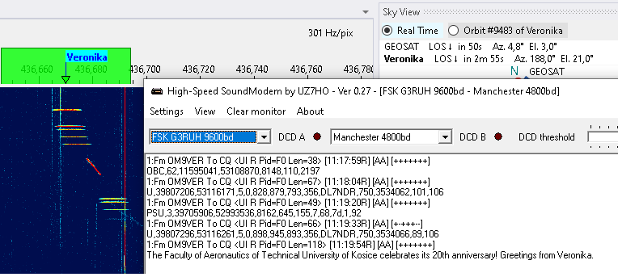
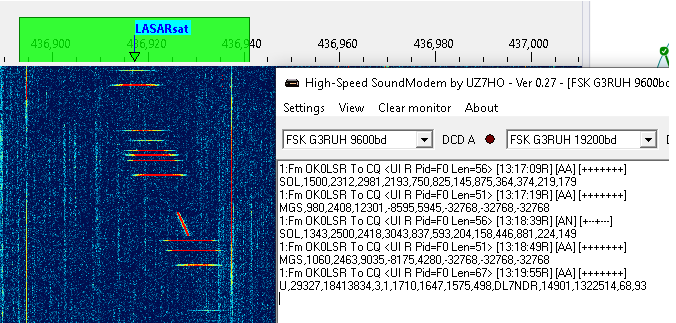

# How to Receive FSK & AFSK Telemetry and other info using UZ7HO packet radio TNCs

_by Marcus PY2PLL_

An external program is needed to decode and display common information usually disseminated using FSK or AFSK. In this tutorial the UZ7HO sound modems will be used. More information about these modems can be found at the
[UZ7HO Personal page](https://uz7.ho.ua/) under **Packet-Radio** - English version.

## Installing VAC

A virtual audio cable, VAC, is required to pass the satellite signals
demodulated in SkyRoof to the decoding program. Download and
install [VB-Audio](https://vb-audio.com/Cable/index.htm) if you do not
have it yet, and reboot your system. Be sure to get the latest version
(2024) of VB-Audio, the old version may not work correctly.

## Setting Up The Sound Modems

- Download and extract zipped files content to new folders -- one
folder for each executable -- somewhere on your PC storage. For
AFSK, e.g. the common modes for APRS, AX-25, 1200bps packet and
other similar modes, use this
[low speed modem](http://uz7.ho.ua/modem_beta/soundmodem114.zip);
for the higher speeds and formats such as 9600/19200 G3RUH FSK, etc., use this
[high speed modem](http://uz7.ho.ua/modem_beta/hs_soundmodem27.zip)
Sometimes there is false virus detection or unsafe download
alert from some web browsers. As already recommended in the SkyRoof
[FAQ](faq.md), scan both links using one of the several online virus
scanning services that you can use to check the link.

    P.S.: there are a few extra modems that can be tested for other
    modulation formats such as BPSK, GMSK. etc. in 
    [this archieve](http://uz7.ho.ua/modem_beta/other-versions.zip). But
    this How-To only covers AFSK and FSK associated to **FM_D**
    SkyRoof mode. For the UZ7HO itself, there is a more detailed user guide at
    [Soundmodem User Guide v114](https://uz7.ho.ua/modem_beta/user_guide_v114_EN.pdf)

- Once downloaded and extracted, create corresponding desktop shortcuts to easy programs launch;
- The following examples will cover **Veronika** or **Tigrisat** satellites FSK data;
- Configure the sound modems audio setup using the already installed VACs. This setup is under Settings => Devices tab. Despite the fact that those modems can be used to TX and RX, the sample picture below assumes that the use is RX only; 
- Select **FSK G3RUH 9600bd** in one of the drop down menus and adjust **DCD slider** up to the point that the "led" blinks a little bit.

## Configuring SkyRoof

In SkyRoof:

- select the Veronika satellite. If it is not in the current group,
add it using the [Satellites and
Groups](satellites_and_groups_window.html) dialog;

- Select **GFSK9K6 AX25** transmitter on the UHF band from the list of transmitters;
- Select **FM_D** downlink mode in the drop-down list on the toolbar;
- in the **Output Stream** section of the
  [Settings](setting_up_output_stream.html) window:
- select **Audio to VAC**;
- set Gain, dB to 0;
- select the VAC in the list of audio devices;
- click on the Output Stream label on the status bar to enable the output.

## Receiving Data

When the selected satellite raises above the horizon, the UZ7HO FSK Modem will start decoding and produce output like this:

For Tigrisat, the decoded telemetry should be like the picture below:

