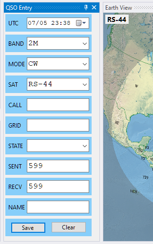
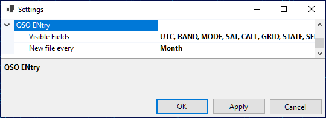
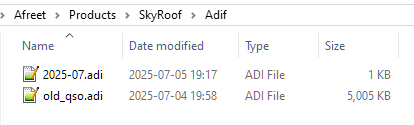
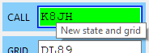

# QSO Entry Panel

The QSO Entry panel allows the operator to enter the QSO details with minimum effort and save them to an ADIF file. This file may be later imported to the logging software for award tracking, QSL management, etc.

## Configuring The Panel

Click on **View / QSO Entry** to open the panel:

You can either dock the panel somewhere in the main window
as described in [Configuring Window Layout](configuring_window_layout.md),
or keep it floating. By resizing the panel you can arrange the input fields in a row, a column, or a matrix:

If you do not need some input fields, disable them in the Settings dialog:

Specify if a new ADIF file should be created every day, month or year, using the **New file every...** setting.

## Entering The QSO Data

- **UTC** - this field shows the current UTC time. Click on it to freeze the clock or to make it run again, or enter the date and time manually if saving an old QSO;
- **Band, Mode, Sat** - These fields are populated automatically, based on the currently selected satellite transmitter. You can select different values from the drop-down lists, or type them in, if needed;
- **Call** - as you enter the callsign, the program tries to guess its grid square, US state and operator's name (see below).
- **Grid, State** - if the program fails to guess these values, or guesses them incorrectly, enter them manually;
- **Sent, Recv** - sent and received reports. Auto-populated with default values when the mode is set, change them manually as needed;
- **Name** - auto-populated if known to the program, otherwise enter manually.

The fields with manually entered values have a blue frame around them, these fields are not auto-populated.

The minimum QSO record consists of **UTC, Band, Mode** and **Call**, all other fields are optional.

## Information Lookup

When the QSO Entry panel opens, it loads all ***.adi** files in the **Adif** sub-folder of the **Data Folder** and builds the lookup lists of the grid squares, states and operator names associated with the callsigns. These lists are used to auto-populate the corresponding input fields. You can put an adif file with all your previous QSO in that folder to help the program build good lookup lists:

## Callsign Status

When the program loads the adif files, it also builds the lists of worked callsigns, grid squares and states. Only the QSO with the `PROP_MODE` field set to `SAT` are counted. As you enter the callsign, the color of the input box changes to indicate the status:

## Interfacing with Logging Software

The QSO Entry panel can interface with logging software, using a simple plugin system, to enter the QSO directly to the log and to get the callsign status and lookup values. The plugin DLL has to export 4 functions:

- Init();
- SaveQso(qso_data);
- GetStatus(qso_data);
- Augment(qso_data).

If you are the author of a logger, please contact me directly for details.
