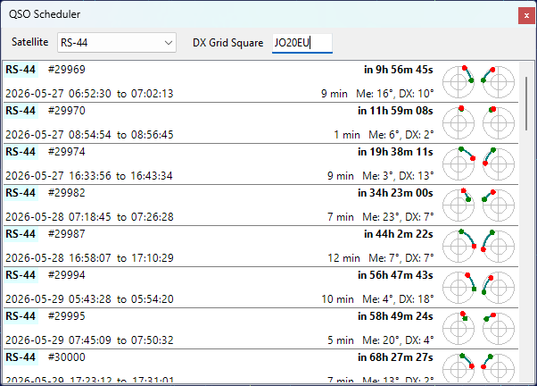
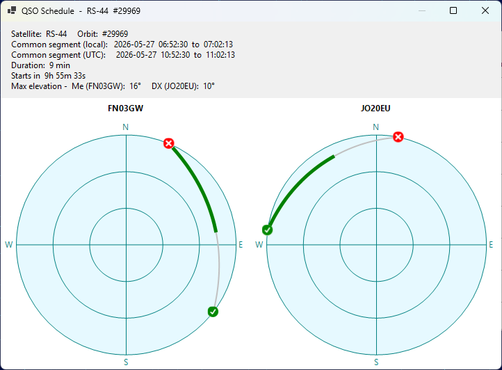

# QSO Scheduler

The QSO Scheduler panel helps you plan a satellite QSO with a DX station by finding the time windows when
the satellite is simultaneously visible from your location and from the DX location.

Click on **View / QSO Scheduler** to open the panel:

## Selecting the Satellite and the DX Station

- **Satellite** - select the satellite for the QSO from the drop-down list. The list contains the satellites
  in the currently selected group, see [Creating Satellite Groups](creating_satellite_groups.md);
- **DX Grid Square** - enter the 4- or 6-character Maidenhead grid square of the DX station. The input
  box turns pink while the value is incomplete or invalid.

Your own grid square and altitude are taken from the user details in the
[Settings Window](settings_window.md). The DX station is assumed to be at sea level.

## Reading the Prediction List

Each item in the list represents one common visibility window for the next 14 days, sorted by start time:

- **Satellite name** is highlighted in light yellow for VHF downlinks and light cyan for UHF downlinks;
- **Orbit number** follows the satellite name;
- **Wait time** on the upper right shows how long until the window starts, or **Now** in green
  if the window is already in progress;
- **Start and end times** of the common segment are displayed in local time (the label shows
  **Geostationary** instead for geostationary satellites);
- **Duration** of the common segment and the maximum elevation of the satellite from each station during
  that segment;
- **Two mini sky-views** on the right show the satellite path during the common segment, as seen from
  your station (left) and from the DX station (right). The green dot marks the start of the segment,
  the red dot marks the end.

## Pass Details

Click on a list item to open the QSO Schedule window with more information about the pass:

The window displays the full sky view for the pass from each station, with the entire pass arc drawn in
silver and the common segment highlighted in green. The green check mark indicates the AOS point, the
red X mark indicates the LOS point. The text above the charts lists the satellite, orbit number, common
segment in local and UTC time, duration, time until the segment starts, and the maximum elevation of the
satellite from each station during the common segment.
