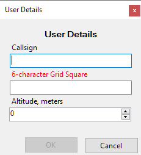
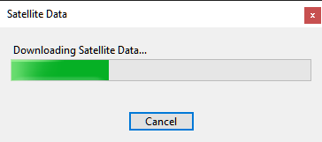
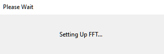

# Quick Start

## Installation

To install SkyRoof, download the installer from the
[Download](/SkyRoof/download.html) page, run it, and follow the on-screen instructions.

## First Run

When you run SkyRoof for the first time, the program performs several important,
but somewhat lengthy steps. Fortunately, they need to be done only once.

### User Information Input

You will be presented with the User Details dialog:

Enter your callsign, 6-character grid square and your altitude above the sea level.
The grid square is required, the program cannot proceed without that information. The other two
values are optional.

### Satellite Data Download

Then SkyRoof downloads the satellite data: make sure that your computer is connected to the
Internet.

Wait until the data are downloaded and imported. Again, SkyRoof cannot proceed without this data
downloaded at least once, so if you click on Cancel, the program terminates.

### FFT Setup

Wait for SkyRoof to try different ways of computing the FFT transform and to find the one that
works best on your system. This may take quite some time!

  

That's all for the quick start! Now you can use the program for tracking the satellites in frequency
and space, and for predicting the satellite passes over your location. To do more than that, you have
to perform the rest of the setup steps described in the next sections.
