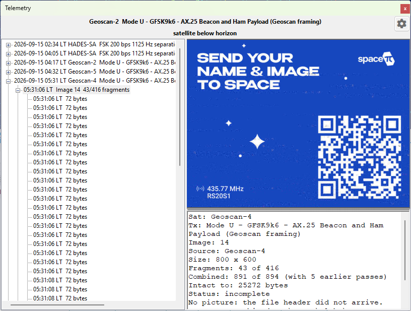

# Receive SSDV Images

Some satellites send still pictures down as data, packed into the same telemetry stream that carries
their housekeeping frames. SkyRoof reconstructs these pictures with its built-in decoder, right
inside the program — there is no need for an external decoder, a Virtual Audio Cable, or an output
stream. The picture is built up fragment by fragment in the [Telemetry](telemetry_panel.md) panel as
the satellite passes overhead.

This is a different thing from [SSTV](recevie_sstv.md), which sends an analog picture over an FM
downlink, line by line. Here the picture is a JPEG file, cut into numbered packets that ride the
telemetry downlink interleaved with ordinary telemetry frames. Nothing extra has to be turned on: if
you are decoding telemetry from a satellite that sends images, the images are decoded too.

## Supported Satellites

Two families of image transport are supported:

- **SSDV packets** — the amateur-satellite digital SSTV format, where each packet carries the image
  ID, its own position in the picture, and a checksum. Sent by **HADES-SA** and by
  **JY1SAT (JO-97)**.

- **Raw JPEG fragments** — the picture is sent as byte ranges of the JPEG file itself. Sent by the
  **Geoscan** fleet and **Lobachevsky**, and by the **Sputnix** satellites — **Luca**, **239Alferov**
  and **HyperView-1G** — as file transfers over their USP telemetry protocol.

The difference matters when the reception is imperfect. An SSDV packet that is lost costs only its
own block of the picture, and the rest of the image is unharmed. In a raw JPEG a lost fragment
desynchronizes everything after it, so the picture is good down to the first gap and, without help,
noise below it — which is why the detail pane reports **Intact to** for these satellites and not for
SSDV. SkyRoof repairs that damage automatically, see [Repairing a Picture](#repairing-a-picture).

## Receiving an Image

The steps are the same as for [decoding telemetry](telemetry_panel.md#decoding-a-pass):

1. Open the [Telemetry](telemetry_panel.md) panel from the **View / Telemetry** menu.

2. Select the satellite in the [Satellite Selector](satellite_selector.md) on the toolbar. If it is
   not in the current group, add it using the [Satellites and Groups](satellites_and_groups_window.md)
   dialog.

3. Select the satellite's **telemetry transmitter** — the one whose frames carry the pictures. Some
   satellites also have a separate **SSDV** row in the database. That row is not a transmitter of its
   own: it is the same signal on the same frequency, so selecting it works as well, and SkyRoof
   quietly pairs it with the co-channel telemetry transmitter that actually carries the packets.

4. Make sure the SDR is running and tuned to the satellite. The decoder uses the same
   Doppler-corrected passband as the receiver, so the satellite's signal must be visible on the
   [waterfall](waterfall_display.md) at the tuned frequency.

Each picture appears as a node in the tree, under the pass node, labeled with the time it was first
seen, the image number, and how many fragments have arrived:

```text
04:12:37  Image 238  9/15 fragments
```

The frames that carry the picture are filed under that node rather than beside it, so a pass of
thousands of fragments still reads as a handful of lines. A fragment that was read and not used says
so: **CRC FAIL** for an SSDV packet whose checksum failed, **duplicate** for one already received,
and **not used** for a raw-JPEG fragment the assembler could not place.

Select the node to watch the picture fill in as the pass goes on. The detail pane below the picture
shows:

- **Sat** and **Tx** — the satellite and the transmitter the picture came from;
- **Image** — the image number the satellite gave it;
- **Source** — the sender, where the protocol names one: the Geoscan satellite that took the picture,
  or the file name for a USP file transfer;
- **Size** — the picture's dimensions in pixels;
- **Fragments** — how many fragments were received, of how many the picture spans;
- **Intact to** — for raw-JPEG satellites, how many bytes of the file are good before the first gap;
- **Repair** — what the repair recovered below that point, when it ran;
- **Status** — `receiving...`, `complete`, or `incomplete` for a picture the pass ended in the
  middle of;
- **Saved** — the file it was written to, once it has been saved.

An incomplete picture is normal rather than exceptional: a pass ends when the satellite sets,
whatever the satellite was in the middle of sending. Missing parts are left gray.

## Saved Images

Each finalized image is saved automatically as a JPEG file, with a JSON sidecar holding its metadata,
in the **SsdvImages** subfolder of the [data folder](data_folder.md). The bytes are written exactly
as received — gaps filled in and the file properly terminated — so whatever fraction of the picture
arrived is a valid JPEG that any program can open.

A reception whose JPEG header never arrived has no picture to write, and the detail pane says so —
**No picture: the file header did not arrive.** Its fragments are still archived, and a later pass
that does catch the header turns them into a picture, see [Combining Passes](#combining-passes).

A picture built from a single fragment is not saved automatically, because one misread frame can look
like one image fragment; neither is one with no recognizable geometry. Such an image is still shown
in the tree and can still be saved by hand.

Right-click a picture in the detail pane to:

- **Save As...** — save the picture to a location of your choice;
- **Copy** — copy the picture to the clipboard;
- **Open in Viewer** — open the automatically saved JPEG in the program that Windows associates with
  JPEG files, where you can see it at full size. This command is available only after the image has
  been finalized and saved, so it stays grayed out while an image is still being received;
- **Repair Damaged Image** — see below;
- **Combine with Previous Passes** — see below.

## Combining Passes

Satellites usually send the same picture several times, over consecutive passes, so that stations
that missed a piece of it can pick that piece up later. SkyRoof can put those receptions together.

Right-click a picture and choose **Combine with Previous Passes**. SkyRoof searches the
**SsdvImages** folder for earlier receptions of the same picture, merges their
fragments with the ones just received, and shows the result. The menu item is grayed out when there
is nothing to combine with, and shows the number of earlier receptions found when there is:
**Combine with Previous Passes (3)**.

The item is a toggle — choose it again to go back to what this pass alone heard. The detail pane
reports both, on separate lines, so you can tell what the current pass contributed:

```text
Fragments: 9 of 15
Combined: 14 of 15 (with 3 earlier passes)
```

Combining stays live while the pass runs: each new fragment is merged in as it arrives, and the
combined picture keeps filling in on screen.



A few limits are worth knowing:

- It works for SSDV as **HADES-SA** sends it, where each packet carries its own checksum, and for the
  raw JPEG of the **Geoscan** fleet and **Lobachevsky**, where a reception that contradicts the ones
  already merged is dropped whole instead. **JY1SAT** packets carry no checksum of their own and the
  **Sputnix** file transfers number a session rather than a file, so the menu item stays grayed out
  for their pictures.

- Geoscan satellites transmit one shared playlist, so a picture received from one of them combines
  with receptions of the same picture from its siblings, as in the example above.

- Only the last **30 days** of the archive are searched. Image numbers are 8-bit and satellites reuse
  them freely — HADES-SA sent images 237, 238 and 239 twice within 92 minutes — so the window is what
  keeps a merge from reaching back to a different picture that happens to share a number. If two
  unrelated pictures do get merged, the result looks obviously wrong: toggle the combination off to
  get the pass's own reception back, exactly as it was.

- The sidecar of each reception records the fragments of **that reception only**, never of a
  combination, so the archive stays a record of what was actually heard.

## Repairing a Picture

In a raw JPEG, a lost fragment breaks the entropy coding, and everything the decoder reads after it
is displaced and colour-shifted — the picture below the first gap is ruined even though most of its
bytes arrived intact. SkyRoof repairs this automatically: it finds the surviving runs of scan data
below each gap, puts them back where the encoder wrote them, and fills what the gap destroyed with
gray. The detail pane reports what it found:

```text
Repair: 2 gaps, 2 runs placed (1104 and 823 MCUs), 1 declined — 1927 of 2400 MCUs recovered
```

A declined run is one whose position could not be established with certainty; leaving it out is the
safe answer rather than a failure. The repair has nothing to configure, and it runs before the
picture is saved, so the JPEG on disk is the repaired one.

It cannot always help — a progressive JPEG, a file with restart markers, or one with no gap in its
scan is emitted unchanged, and SSDV pictures never need it, because there a lost packet costs its own
blocks and nothing else. Where it did run, **Repair Damaged Image** in the right-click menu is
checked and can be unchecked to see the picture as the bytes came down. The item is grayed out on a
picture the repair did not run on.

## See Also

- [Telemetry Panel](telemetry_panel.md)
- [Receive SSTV Images](recevie_sstv.md)
- [Receive CODEC2 Voice Messages](receive_voice.md)
