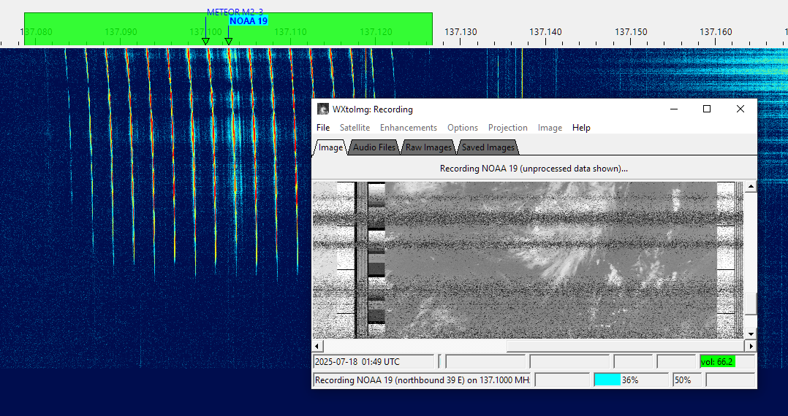

# Receive Images from NOAA-15

An external program is needed to decode and display the weather images transmitted by the NOAA-15 and NOAA-19 satellites. In this tutorial we will use [WXtoIMG](https://wxtoimgrestored.xyz/downloads/). 

## Installing VAC

A virtual audio cable, VAC, is required to pass the satellite signals demodulated in SkyRoof to the image decoding program. Download and install [VB-Audio](https://vb-audio.com/Cable/index.htm) if you do not have it yet, and reboot your system. Be sure to get the latest version (2024) of VB-Audio, the old version may not work correctly.

## Setting Up WXtoIMG

- download
[wxinst21102-beta.exe](https://wxtoimgrestored.xyz/beta/wxinst21102-beta.exe)
and run the installer, then start WXtoIMG;
- enter your latitude and longitude when prompted;
- the program tries to download the TLE data from a URL that no longer works.
  Download the [weather.txt](https://celestrak.org/NORAD/elements/gp.php?GROUP=weather&FORMAT=tle)
file manually and save it to the WXtoIMG data folder. Type this in File Explorer to find the data folder:

  ```txt
  %appdata%\WXtoImg
  ```

- tick **Satellite / Autodetect APT** in the menu;
- click on **Options / Recording Options** and select the **Record only when active...** radio button. Select the VAC cable in the **soundcard** drop-down list;
- click on **File / Record** in the menu, then
  - select **Record and auto process**;
  - tick **Create images**;
  - click on the **Auto Record** button.

## Configuring SkyRoof

In the SkyRoof:

- select the NOAA-15 or NOAA-19 satellite. If it is not in the current group, add it using the
[Satellites and Groups](satellites_and_groups_window.md) dialog;
- Select **APT** transmitter on the 137 MHz band from the list of transmitters;
- Select **FM_D** downlink mode in the drop-down list on the toolbar;
- in the **Output Stream** section of the [Settings](setting_up_output_stream.md) window:
  - select **Audio to VAC**;
  - set Gain, dB to 0;
  - select the VAC in the list of audio devices;
  - click on the Output Stream label on the status bar to enable the output.

## Receiving Images

When the selected satellite raises above the horizon, WXtoIMG will start decoding and produce an image like this:



At the end of the pass WXtoIMG will post-process received data and display an enhanced image:


