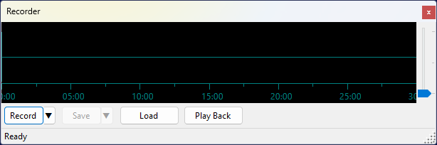
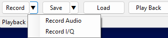
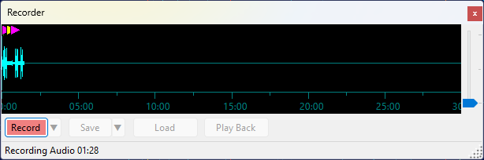
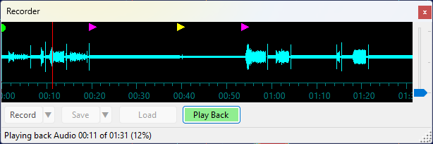
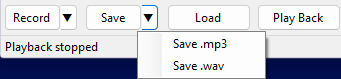

# Recorder Panel

The Recorder panel records the received audio or I/Q signal and plays it back later.
Up to 30 minutes of data can be stored in the recording buffer.

## Recording

Click **Record** to start recording audio. To choose what to record, click the **▼** button next to Record:

- **Record Audio** — records the demodulated audio signal (mono);
- **Record I/Q** — records the complex baseband I/Q signal (stereo).

The button turns red and the status bar shows the recording type and elapsed time while recording is active.
Click **Record** again to stop.

The waveform display shows the recorded signal growing from the left. The full 30-minute buffer width is
always shown during recording, so the waveform expands to fill it as the recording progresses.

## Event Markers

While recording is active, the panel automatically tracks changes in the selected satellite, transmitter,
and mode, as well as QSOs saved in the [QSO Entry](qso_entry_panel.md) panel. These events appear as
colored markers along the top edge of the waveform:

- **green circle** — satellite selection changed;
- **magenta triangle** — transmitter selection changed;
- **yellow triangle** — demodulation mode changed;
- **cyan square** — QSO saved.

Move the mouse cursor over a marker to see a tooltip with the details of that event.

## Playback

Click **Play Back** to play back the recording. The button turns green and a red vertical line
moves across the waveform to show the current position. The status bar shows the elapsed time,
total duration, and progress percentage.

Click anywhere on the waveform during playback to seek to that position.

Click **Play Back** again to stop playback.

## Saving and Loading

Click **Save** to save the recording. To choose the file format, click the **▼** button next to Save:

- **Save .mp3** — available for audio recordings only; saves a compressed MP3 file resampled to 16 kHz;
- **Save .wav** — saves a 48 kHz 32-bit float WAV file. Audio recordings are saved as mono;
  I/Q recordings are saved as stereo (left channel = I, right channel = Q).

Click **Load** to load a previously saved .wav or .mp3 file into the buffer for playback.

The Save and Load dialogs open in the **Recordings** subfolder of the [data folder](data_folder.md) by default.

## Playback Routing

During playback, audio is sent to the same soundcard that is selected in [Settings](setting_up_audio.md) for SDR audio output.
Both audio and I/Q are also routed through the same output channel (VAC or UDP) that is configured
for the [Output Stream](setting_up_output_stream.md) function in the [Settings](setting_up_output_stream.md), so external applications can receive
the played-back signal just as they would a live signal.

## Waveform Display

The vertical gain slider on the right edge of the waveform adjusts the display amplitude in dB,
making quiet signals easier to see. It does not affect the recording or playback level.

