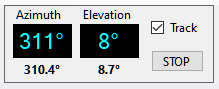
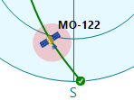
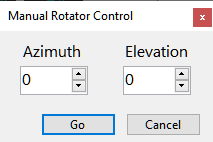

# Rotator Control

The Rotator Control panel on the status bar shows the current position of the selected satellite
and the antenna bearing, if the rotator control function is enabled:

## Display

The large Azimuth and Elevation display shows the satellite location, the small numbers below it
show the antenna bearing.

The satellite location is dimmed when the rotator control function is disabled. Click on **Rotator**
on the status bar to enable or disable this function.

When rotator control is enabled, the current antenna bearing is marked on the
[Sky View panel](sky_view_panel.md) with a red spot:

## Tracking

When rotator control is enabled but the **Track** checkbox is not ticked, the panel only displays the antenna
bearing but does not attempt to change it. Tick the **Track** checkbox to start tracking. Note that
the check box is cleared when a different satellite is selected.

In the satellite tracking mode, the antenna bearing turns pink if it differs from the satellite position
by more than the **Step Size** setting entered in the
[rotator settings](setting_up_rotator_control.md).

## Manual Control

Click on the satellite positon display to open the **Manual Rotator Control** window:

## Stopping

To stop antenna rotation, either manual or due to the satellite tracking, click on the **Stop** button.
