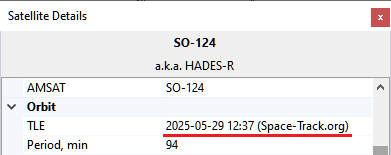
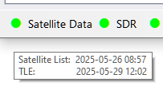

# Satellite Data

## Data Sources

SkyRoof obtains satellite date from sevaral sources:

- [SatNOGS DB](https://db.satnogs.org/) is the main source of satellite data.
    It is a frequently updated, crowd-sourced dataset that contains detailed information
    about all satellites transmitting in the Ham bands;
- [JE9PEL Satellite List](https://www.ne.jp/asahi/hamradio/je9pel/satslist.htm) is another
    dataset with information about the satellites, maintained by Mineo Wakita JE9PEL, that,
    in particular,
    includes the callgigns of the satellites. This dataset presents the frequencies in an
    undocumented format, so its data are included in the SkyRoof database only FYI.

- [LoTW](https://www.arrl.org/quick-start) - The ARRL LoTW service accepts satellite QSO
    only if the satellite abbreviation is one of those published on their
    [web site](https://lotw.arrl.org/lotw-help/frequently-asked-questions).
    These abbreviations are stored in a file in the
    [Data folder](data_folder.md), you can view them in the
    [Satellite Details window](satellite_details_window.md).

- [AMSAT Live OSCAR Satellite Status Page](https://www.amsat.org/status/) accepts satellite
    observations with their own satellite abbreviations, these abbreviations are stored in a file in the
    [Data folder](data_folder.md).

## TLE

The satellite orbit elemants ([TLE](https://celestrak.org/columns/v04n03/) data)
are downloaded from **SatNOGS DB**.

SatNOGS obtains these data from differnt sources and makes the latest and most reliable data
available on their web site. The source of TLE and its creation time are shown in the
[Satellite Details window](satellite_details_window.md)
or [panel](satellite_details_panel.md):

and in the mouse tooltip of the satellite:

## Automatic Updates

SkyRoof automatically downloads the satellite list every 7 days, and TLE data every 24 hours.

The mouse tooltip of the Satellite Data label on the status bar shows the last download time:

The light next to the label turns yellow if the satellite data are not up to date.

## Manual Updates

In addition to automatic downloads, the data may be manually downloaded at any time using
the **Tools / Download All Satellite Data** and **Tools / Download Only TLE** menu commands.

## Loading TLE from File

If your system is not connected to the Internet, you can load TLE data from a local file
using the **Tools / Load TLE from File** menu command. Two TLE formats are supported:

- **.json** - TLE data from the SatNOGS web site, recommended ([download](https://db.satnogs.org/api/tle/?format=json));
- **.txt** - 3-line TLE data in a text file, available from many sources, e.g. CelesTrak
    ([download](https://celestrak.org/NORAD/elements/gp.php?GROUP=amateur&FORMAT=tle)).

Note that TLE import cannot add new satellites, it only loads orbital elements for the satellites already in the database.

## AMSAT Satellite Status

[AMSAT Live OSCAR Satellite Status Page](https://www.amsat.org/status/) is a crowd-soourced, real-time Ham satellite status page.

### Posting Status Data

You can post your satellite status observations the the AMSAT web site either by filling the sumbission form on their
site, or using the right-click menu of the satellite   labels on the [Frequency Scale](frequency_scale.md).
A valid Ham callsign must be entered in the [Settings window](settings_window.md) for this function to work.

### Downloading Status Data

Set the **Amsat Satellite Status / Enable** option in the Settings window to `true` to enable automatic downloads of the
satellite status information from the AMSAT web site. The statuses are shown on the [Current Group](current_group_panel.md)
panel, the green and red icons represent the active and inactive status respecively.

Satellite status data are downloaded once an hour. You can manually download it at any time using the
**Tools / Download AMSAT Statuses** menu command.
