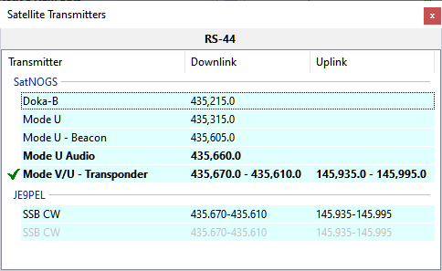

# Satellite Transmitters

The Satellite Transmitters panel shows the list of transmitters carried by the currently selected satellite. It is similar to the
bottom part of the
[Satellite Details window](satellite_details_window.md)
but is dockable for permanent visibility:

Click on the transmitter in the **SatNOGS** section to select it. Move the mouse cursor over the transmitter name to see the details
on the mouse tooltip.
