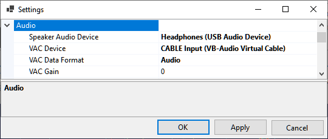

# Setting Up Audio

Click on **Tools / Settings** in the main menu to open the [Settings window](settings_window.md):

- **Speaker Audio Device** - select the audio device that will be used to output the audio
    received with SDR;
- **VAC Device** - the same audio or I/Q stream may be also sent to the external software 
    via a Virtual Audio Cable (VAC). Select the VAC device here;
- **VAC Data Format** - the format of the output stream, either audio or I/Q data sampled at 48 kHz;
- **VAC Gain** - gain or attenuation, in dB, that will be applied to the VAC output.

The output to the soundcard and VAC can be toggled by clicking on the **Soundcard** and **Output Stream** labels
on the status bar. A drop-down list next to **Soundcard** allows switching between the audio devices:

