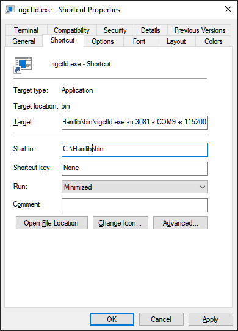
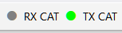

# Setting Up CAT Control

> [!WARNING]
> The initial release of the beta version was tested only with an IC-9700 radio.
> The code for other radio models is present but has not been tested. If you have a different radio
> and are willing to do extensive testing, please send me an email.

## rigctld.exe

SkyRoof uses **rigctld.exe**, a HamLib-based CAT control daemon, to control the radio.

1. Download **hamlib-w64-4.5.5.exe** [from GitHub](https://github.com/Hamlib/Hamlib/releases/tag/4.5.5).
Other versions may not work correctly.
2. Run the downloaded file to install HamLib, note the folder where it is installed.
3. Create a shortcut to start **rigctld.exe*, with command line arguments:

    

    The arguments on the command line must be tailored for your specific radio and COM port settings. Refer to the
    [rigctld documentation](https://hamlib.sourceforge.net/html/rigctld.1.html) for a complete description
    of the arguments.

    Assuming that HamLib is installed in the default location, here is an example string for the shortcut:

    ```cmd
    "C:\Program Files\hamlib-w64-4.5.5\bin\rigctld.exe" -m 3081 -r COM9 -s 115200 
    ```

    In the string above the following arguments are used:

    - **-m 3081** - the radio model is IC-9700;
    - **-r COM9** - the COM port used by the radio. In this case, the USB connection to IC-9700 creates two virtual
        COM ports, COM9 and COM10. The port with the lower number is used for CAT;
    - **-s 115200** - use the highest available COM port speed.

4. Run rigctld.exe using this shortcut before you enable CAT control in SkyRoof.

## Settings

Click on **Tools / Settings** in the main menu to open the
[Settings dialog](settings_window.md):


- **Delay** determines how often SkyRoof sends commands to the radio. The default delay of 100 ms
    is good in most cases. Increase the delay if your radio is slow;
- **Log Traffic** should be set to False and enabled only for debugging;
- **Ignore Dial Knob** - by default, CAT control allows you to change the frequency both in the program and by
    spinning the dial knob. If for some reason this causes trouble, change this setting to True, then the dial knob
    will be ignored.

The two sections in the Settings, **RX CAT** and **TX CAT**, allow you to use either the same radio for RX and TX, or
two different radios. You can also enable only one of those, or disable both. The recommended configuration is to use an SDR for reception and a transceiver for transmission, in this case RX CAT should be disabled.

To use the same radio for RX and TX, set **Host**, **TCP Port** and **Radio Type** to the same values in
both sections.

To use two different radios, create a second shortcut for the second radio, and specify a different port number on the command line.
Enter this port number in the settings as well, and run two instances of **rigctld.exe** using both shortcuts.

The settings in the RX and TX sections are:

- **Host** - should be "127.0.0.1" or "localhost" if rigctld is running on the same computer as SkyRoof. It may be changed to a
    different address for remote control;
- **TCP Port** - 4532 is the default port used by rigctld. Use a different port in one of the sections to control different radios for RX and TX;
- **Enabled** - enable or disable CAT. Another way to toggle CAT is to click on the CAT labels on the status bar:

    

- **Radio Type** - as mentioned above, the beta version has been tested only with IC-9700, which is a duplex transceiver.
    Change this setting if you want to test a radio of a different type;
- **Show Corrected Frequency** - The SkyRoof can display either the nominal frequency of the satellite transmitter, or the
    frequency with all corrections applied. Another way to toggle this setting is via a right-click menu on the frequency
    display on the toolbar.
