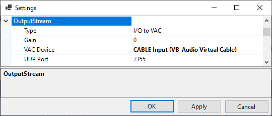
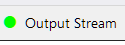

# Setting Up Output Stream

SkyRoof can optionally send the raw I/Q data or demodulated audio, either to a Virtual Audio Cable (VAC) or as a stream of UDP packets. The data are sent as 32-bit floating point values in the IEEE 754 format.
The sampling rate is 48 kHz in all streaming modes.

## Configuring

Click on **Tools / Settings** in the main menu to open the [Settings window](settings_window.md):

- **Type** - select the stream type:
  - I/Q to VAC;
  - Audio to VAC;
  - I/Q to UDP;
  - Audio to UDP.
- **Gain** - gain or attenuation, in dB, that will be applied to the stream data;

- **VAC Device** - the Virtual Audio Cable device to use;
- **UDP Port** - the UDP port number to use.

Output streaming can be turned on and off by clicking on the **Output Stream** label
on the status bar:

