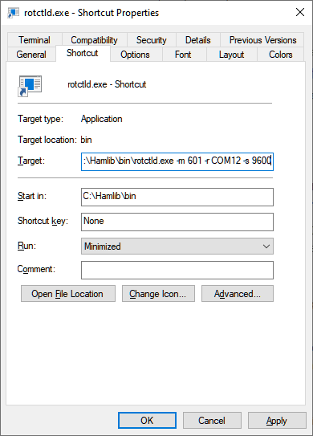
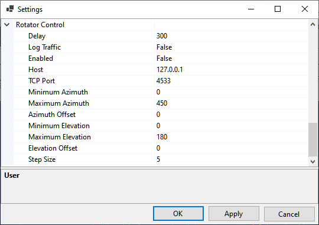

# Setting Up Rotator Control

## rotctld.exe

SkyRoof uses **rotctld.exe**, a HamLib-based rotator control daemon, to control the antenna rotator.
See the [Setting Up CAT Control](setting_up_cat_control.md) section for the instructions how to
download and install HamLib.

Create a shortcut to start **rotctld.exe*, with command line arguments:



The arguments on the command line must be tailored for your specific rotator and COM port settings. Refer to the
[rotctld documentation](https://hamlib.sourceforge.net/html/rotctld.1.html) for a complete description
of the arguments.

Assuming that HamLib is installed in the default location, here is an example string for the shortcut:

```cmd
"C:\Program Files\hamlib-w64-4.5.5\bin\rotctld.exe" -m 601 -r COM12 -s 9600 
```

In the string above the following arguments are used:

- **-m 601** - the rotator model is Yaesu GS-232A;
- **-r COM12** - the COM port used by the rotator;
- **-s 9600** - the COM port speed.

 Run rotctld.exe using this shortcut before you enable rotator control in SkyRoof.

 The list of rotator models supported by rotctld.exe is available on the
 [HamLib web site](https://github.com/Hamlib/Hamlib/wiki/Supported-Rotators). Note that one of the models is **PSTRotator**. When this model is selected, rotctld.exe just passes the rotation commands to the PST Rotator software.

## Settings

Click on **Tools / Settings** in the main menu to open the
[Settings dialog](settings_window.md):



- **Delay** determines how often SkyRoof sends commands to the rotator. The default delay is 300 ms, but you can set it to a lower value, such as 100 ms, without adverse effects;
- **Log Traffic** should be set to False and enabled only for debugging;
- **Enabled** - enable or disable rotator control. Another way to toggle the rotator control
    is to click on the Rotator label on the status bar;
- **Host** - should be "127.0.0.1" or "localhost" if rotctld is running on the same computer as SkyRoof. It may be changed to a
    different address for remote control;
- **TCP Port** - 4533 is the default port used by rotctld;
- **Minimum Azimuth**, **Maximum Azimuth**, **Minimum Elevation**, **Maximum Elevation** -
    specify the range of azimuth and elevation values your rotator accepts;
- **Azimuth Offset**, **Elevation Offset** - if your rotator is not perfectly calibrated, these settings
    allow you to apply a correction;
- **Step Size** - to prevent the rotator from starting and stopping too often, change the bearing
    only when the required change is greater than the step size. The default value is 5 degrees.

<br>

If your rotator does not control elevation, set the MinimumElevation and MaximumElevation to the same value. With such settings,
wrong elevation will not be considered a bearing error. Note that the bearing error is indicated with a pink color
on the [Rotator Control](rotator_control.md) panel.

## See Also

- [Smart Antenna Rotation](smart_antenna_rotation.md)