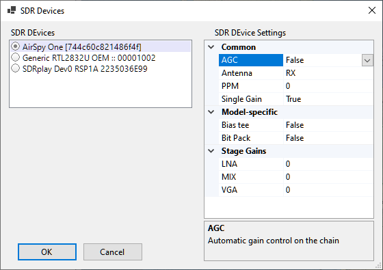
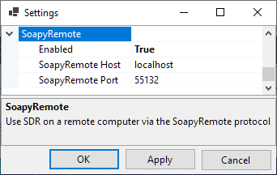
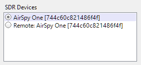

# Setting Up SDR

## Supported Radios

SkyRoof uses the
[Soapy SDR](https://github.com/pothosware/SoapySDR)
engine to interface with the SDR radios. The drivers for the following radios are included in the SkyRoof setup:

- Airspy;
- AirspyHF+;
- SDRplay;
- RTL-SDR;
- HackRF;

Radios that are not on this list can also be used, see
[Adding Support of Other Radios](#adding-support-of-other-radios) below.

## Installing The Drivers

Most of the SDR devices require the driver to be installed before you can start using them. Check the manufacturer's web site,
or search on Google, for the driver installation instructions. At the time of this writing, the following instructions were available on the Web:
[Airspy](https://airspy.com/quickstart/),
[RTL-SDR](https://www.rtl-sdr.com/rtl-sdr-quick-start-guide/),
[SDRplay](https://www.sdrplay.com/api/),
[HackRF](https://hackrf.readthedocs.io/en/latest/installing_hackrf_software.html),
[PlutoSDR](https://wiki.analog.com/university/tools/pluto/users/quick_start).

Once you install the drivers and make your radio work with its native software, proceed to the next step.

## Adding Support of Other Radios

SkyRoof can work with any SDR that has a SoapySDR driver module, even if the module does not come with SkyRoof.
To add such a radio:

- obtain the SoapySDR driver module for your radio. Pre-built modules for Windows are included in
  [PothosSDR](https://downloads.myriadrf.org/builds/PothosSDR/), where they are located in the
  `lib\SoapySDR\modules0.8` folder. The complete list of the SoapySDR drivers, with links to their
  source code, is available on the
  [SoapySDR wiki](https://github.com/pothosware/SoapySDR/wiki/PluginGuide).
  The module must be a 64-bit build for the SoapySDR ABI version 0.8;

- copy the module dll, and any dlls that it depends on, to the `lib\SoapySDR\modules0.8` folder
  of the SkyRoof installation, usually `C:\Program Files\Afreet\SkyRoof\lib\SoapySDR\modules0.8`;

- install the manufacturer's driver for the radio as described in the previous section;

- restart SkyRoof and open the **SDR Devices** dialog. The radio should appear in the list of devices.

> [!NOTE]
> Some driver modules interfere with the detection of other SDR devices. The PlutoSDR module is one such
> example, and for this reason it is no longer included in the SkyRoof setup. If your radios are no longer
> detected after you add a new module, delete that module from the `modules0.8` folder.

## Selecting an SDR device

Connect your SDR device to the computer, then click on **Tools / SDR Devices** in the main menu. This will open the
**SDR Devices dialog**:



All active SDR devices are listed on the left panel. Click on the one that you want to use.

## Configuring the device

The right panel shows all settings that the device driver understands. The setting names and descriptions (shown on the
bottom panel) come from the driver, with two exceptions described below. For information about these
settings see the documentation that comes with the radio.

The two settings, common to all radios, are:

- **PPM** - the correction factor for the SDR clock frequency, expressed in parts per million.
  This setting is important for the correct operation of the Doppler tracking algorithm, see the
  [Calibrating PPM Correction](calibrating_ppm_correction.md) section for details;

- **Single Gain** - when set to true (**and AGC is off**), the SDR gain is controlled by the **RF Gain** slider on the toolbar.
  This is the recommended setting. When it is set to false, the settings in the **Stage Gains** are applied to the
  individual stages of the SDR, and the gain slider is disabled.

## Using an SDR with a Transverter

If you connect your SDR to the IF output of a VHF/UHF transverter (so the SDR is tuned to
28–30 MHz while it actually receives 144/432 MHz signals), enable the **SDR Offset** in the
**Transverter** section of the Settings. SkyRoof will tune the SDR to the IF band while the
waterfall scale and the frequency display continue to show the actual satellite RF.
See [Setting Up Transverter](setting_up_transverter.md).

## Using Remote SDR

SkyRoof can use SDR devices connected to a remote (or local) computer via the
[SoapyRemote](https://github.com/pothosware/SoapyRemote) driver. To enable remote access to SDR:

- **On the remote computer:**
  - install SoapySDR which is available as part of [PothosSDR](https://downloads.myriadrf.org/builds/PothosSDR/);
  - run the remote server that comes with SoapySDR:

    ```text
    SoapySDRServer.exe --bind
    ```

- **In SkyRoof:**
  - enable **SoapyRemote** in the **Settings** dialog;
  - enter the **host** name of the remote computer, or leave "localhost" if the radio is on the same computer.

    

  - Open the **SDR Devices** dialog and select the remote SDR device from the list. If the device and remote server are on the localhost, you will have a choice between a direct connection to the radio and a connection via the server.

    
