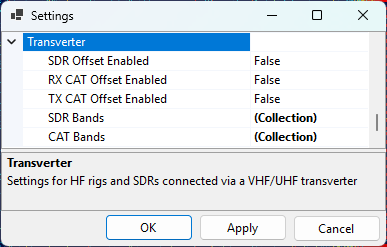
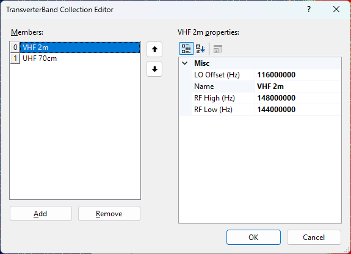

# Setting Up Transverter

If you receive on an HF SDR connected to a VHF/UHF transverter, or transmit with an HF
transceiver connected to a transverter, the SDR and the rig "see" the satellite signal at the
transverter's **IF frequency** (typically 28–30 MHz), not at the actual RF frequency
(144 MHz, 432 MHz). SkyRoof can apply the LO offset for you so that:

- the **SDR** is tuned to the IF that the transverter outputs, while the waterfall scale and the
  frequency display continue to show the RF frequency of the satellite;
- the **transceiver** (via CAT) receives the IF frequency that it can actually tune, instead of
  the VHF/UHF frequency that it cannot.

The three offsets — for the SDR, for the RX CAT channel and for the TX CAT channel — are
independently enabled, so you can mix-and-match: a smart VHF/UHF rig with an SDR-on-transverter
setup, a dumb HF rig with the SDR on the antenna directly, or any other combination.

> [!NOTE]
> Frequencies are **always** displayed at the actual RF (144/432 MHz). The IF translation is
> applied internally by SkyRoof when it tunes the SDR or sends a CAT command.

## When You Need This

- **HF transceiver + transverter, no built-in XVRT support** (e.g., IC-735, IC-7300):
  enable **RX CAT** and **TX CAT** offsets. SkyRoof sends 29.950 MHz to the radio when the
  satellite is on 145.950 MHz.

- **Modern transceiver with built-in XVRT offset** (e.g., K3S + Elecraft XV):
  the radio already converts internally. Leave the **CAT** offsets **disabled** so SkyRoof
  sends the RF frequency, which the rig converts itself.

- **HF SDR on the transverter IF output** (e.g., Airspy HF+, RTL-SDR with an upconverter on
  HF range, IC-R7000 IF tap): enable the **SDR** offset. The SDR is tuned to the IF band, but
  the waterfall and frequency display continue to show the actual satellite RF.

- **VHF/UHF SDR on the antenna directly, no transverter**: leave all three offsets disabled;
  SkyRoof behaves exactly as without this feature.

## Settings

Click on **Tools / Settings** in the main menu to open the
[Settings dialog](settings_window.md), then expand the **Transverter** section:

- **SDR Offset Enabled** — when on, the SDR is tuned to the IF of the matching SDR transverter
  band, not to the satellite RF;
- **RX CAT Offset Enabled** — when on, the RX frequency sent to the radio is offset by the LO of
  the matching CAT band;
- **TX CAT Offset Enabled** — same, for the TX frequency.
- **SDR Bands** — list of bands for the SDR path;
- **CAT Bands** — list of bands for the CAT path.

The two band lists are separate because the SDR transverter and the transmit transverter often
use different local oscillators, and because the CAT path's RF range may be narrower than the
SDR path (the SDR sees the entire transverter passband, but the radio's HF receiver can only
tune a slice of it).

### Editing Bands

Click the **...** button in the **SDR Bands** or **CAT Bands** row to open the collection
editor. You can **add new bands, edit the existing ones, or delete bands**:

Each band has:

- **Name** — a free-text label (e.g., `VHF 2m`, `UHF 70cm`, `23 cm`);
- **RfLow / RfHigh** — RF frequency range in Hz, inclusive;
- **LoOffset** — local oscillator offset in Hz. IF = RF − LO.

When SkyRoof needs the IF for an active RF, it looks up the first band whose `[RfLow, RfHigh]`
range covers that RF and subtracts its `LoOffset`. If no band matches, the offset is zero (SDR
case) or the CAT command is skipped with a warning (CAT case — see below).

### Restoring the Defaults

If you delete entries from a band list and want to bring back the seeded defaults, right-click
on the **SDR Bands** or **CAT Bands** row and choose **Reset**. This replaces the entire list
with the default entries. An empty list, on its own, is preserved across sessions — SkyRoof
will not "helpfully" re-seed it on the next launch.

## Default Bands

### Default SDR Bands

| Name      | RF Low (MHz) | RF High (MHz) | LO (MHz) | IF Range       |
|-----------|--------------|---------------|----------|----------------|
| VHF 2m    | 144.000      | 148.000       | 116.000  | 28.0–32.0 MHz  |
| UHF 70cm  | 432.000      | 438.000       | 407.000  | 25.0–31.0 MHz  |

The SDR band table covers the full ham VHF allocation and the satellite portion of the UHF
allocation. The IF spans (4 MHz and 6 MHz) exceed the SDR's maximum bandwidth of 3.1 MHz, so
the SDR cannot show the entire transverter passband at once — see [Behavior at Runtime](#behavior-at-runtime)
below for how SkyRoof handles this.

### Alternative SDR Bands (10.7 MHz IF)

For receivers that use 10.7 MHz as the IF output (e.g., the IC-R7000 wideband communications
receiver), edit the SDR bands to use these LO values instead:

| Name      | RF Low (MHz) | RF High (MHz) | LO (MHz) | IF Range       |
|-----------|--------------|---------------|----------|----------------|
| VHF 2m    | 144.000      | 148.000       | 135.300  | 8.7–12.7 MHz   |
| UHF 70cm  | 432.000      | 438.000       | 424.300  | 7.7–13.7 MHz   |

### Default CAT Bands

| Name                  | RF Low (MHz) | RF High (MHz) | LO (MHz) | IF Range      |
|-----------------------|--------------|---------------|----------|---------------|
| VHF 2m                | 145.800      | 146.000       | 116.000  | 29.8–30.0 MHz |
| UHF 70cm AO-7 uplink  | 432.000      | 434.000       | 404.000  | 28.0–30.0 MHz |
| UHF 70cm              | 435.000      | 437.000       | 407.000  | 28.0–30.0 MHz |

The CAT RF ranges are narrower than the SDR ranges so the resulting IF lands inside a typical
HF rig's tuning range (28–30 MHz). The AO-7 mode U-V uplink (432–434 MHz) is split into its
own entry because it uses a different LO than the rest of the 70 cm band.

## Behavior at Runtime

When **SDR Offset Enabled** is on:

- The SDR is retuned to the IF center of the active satellite's band on the first activation
  and whenever the satellite crosses to a different band. The waterfall history resets on each
  such retune;
- Within a band, only the audio slicer offset moves as the Doppler-corrected signal drifts;
  the SDR center stays put and the waterfall keeps scrolling;
- If the transverter band is wider than the SDR's bandwidth (the default 4 MHz VHF and 6 MHz
  UHF bands are), the SDR center is repositioned as needed to keep the Doppler-corrected signal
  visible, while keeping the SDR passband within the transverter band limits;
- The frequency scale, the satellite labels and the pass-visibility check always work in RF, so
  what you see on screen is the satellite's actual frequency regardless of where the SDR is
  physically tuned.

When **RX CAT** or **TX CAT** offset is enabled but the active RF does not fall into any CAT
band, SkyRoof **skips the CAT frequency command** rather than sending a frequency the radio
cannot tune. A warning is written to the log, and:

- the corresponding **RX CAT** or **TX CAT** label on the status bar turns **yellow**;
- the tooltip on that label explains the out-of-band condition, naming the offending
  frequency.

This is the signal that you need to either disable the CAT offset (if you are listening to a
non-ham satellite) or add a band entry to the CAT list (if you want to extend coverage).

## Frequency Display Tooltips

When any of the three offsets is enabled, the tooltip on the downlink and uplink frequency
display in the [Frequency Control](frequency_control.md) panel includes extra lines:

- `SDR Transverter IF: <value> MHz` — only on the downlink, when the SDR offset is enabled
  and an SDR band matches;
- `CAT Transverter IF: <value> MHz` — on the downlink when RX CAT offset is enabled, and on
  the uplink when TX CAT offset is enabled, when a CAT band matches.

This lets you confirm at a glance what IF frequency is being sent to the SDR and to the radio.

## Common Configurations

### K3S with XVRT + SDR on the transverter IF

- `SdrOffsetEnabled = true`, both CAT offsets `false`.
- SkyRoof tunes the SDR to the IF band and keeps the satellite visible there.
- SkyRoof sends 435.835 MHz to the K3S (unchanged); the rig applies its own XVRT conversion
  internally.

### IC-7300 (no transverter awareness) + SDR on the transverter IF

- `SdrOffsetEnabled = true`, `RxCatOffsetEnabled = true`, `TxCatOffsetEnabled = true`.
- Downlink 435.835 MHz → SDR shows 28.835 MHz IF; IC-7300 commanded to 28.835 MHz.
- Uplink 145.965 MHz → IC-7300 commanded to 29.965 MHz.
- The IC-7300 covers 1.8–54 MHz continuously, so both IFs are inside its tuning range.

### SDR on the antenna, smart rig

- All offsets disabled. Behaviour is identical to a SkyRoof setup without any transverter.

### AO-7 mode U-V

- Uplink 432.xxx MHz → matches the **UHF 70cm AO-7 uplink** CAT band → CAT LO = 404 MHz →
  IF ≈ 28.xxx MHz.
- Downlink 145.xxx MHz → matches the SDR's **VHF 2m** band → SDR LO = 116 MHz →
  IF ≈ 29.xxx MHz.

### Non-ham telemetry satellite (e.g., 400.550 MHz)

- No CAT or SDR band covers 400 MHz → both offsets resolve to zero → SDR tunes directly to
  400.550 MHz, RF is sent to the radio (if it can tune there) → no transverter behaviour.

## See Also

- [Setting Up SDR](setting_up_sdr.md)
- [Setting Up CAT Control](setting_up_cat_control.md)
- [Frequency Control](frequency_control.md)
