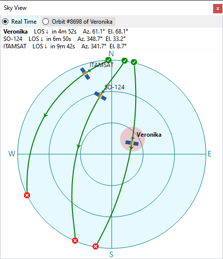

# Sky View

The Sky View panel shows the trajectory of the satellites in the sky, as visible at your location:

The radio buttons at the top switch the chart between the real-time display showing all satellites in the
selected group that are currently above the horizon, and a specific pass of a specific satellite.

The pink spot indicates the current antenna bearing if
[Rotator Control](rotator_control.md) is enabled.

To select the pass to be displayed, click on it in the
[Current Group panel](current_group_panel.md),
[Satellite Passes panel](satellite_passes_panel.md) or
[Time Line panel](time_line_panel.md).

Click on the satellite name next to the satellite icon to make it selected.
