# Smart Antenna Rotation

SkyRoof uses a new antenna rotation algorithm, based on dynamic programming, that globally optimizes the tracking of the satellite pass and ensures the minimum possible communication downtime. The algorithm makes full use of the extended range of azimuth and elevation available in the modern rotators.

## Limitations of the Simple Approach

The satellite pass prediction algorithm computes the satellite azimuth in the range of __0° to 360°__ and elevation in the range of __0° to 90°__. A simple antenna rotator just sends these azimuth and elevation values to the controller. This works most of the time, but there are cases when this requires the antenna to rotate by 180° or 360°. While the antenna is making this full circle, or half-circle, it does not point at the satellite, causing a significant downtime in the communication. The charts below show two such cases.

In the first chart the path crosses the  360° azimuth line, and the antenna needs to make a full circle counter clockwise to get to 0°.

In the second chart, when the satellite is at its highest elevation point, its azimuth quickly changes from South to North, by about 180°. This rotation may take up to a minute, causing a significant downtime.

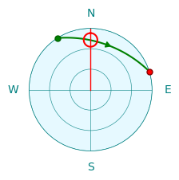
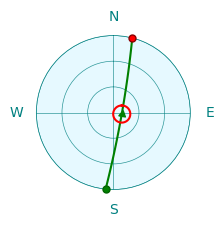

## Rotator Capabilities

Many antenna rotators have an extended range of azimuth and elevation that goes beyond the __0° to 360°__ for the azimuth and __0° to 90°__ for the elevation. This allows the controller to point the antenna in the same direction in more than one way. We will use
[Yaesu G-5500DC](https://www.yaesu.com/product-detail.aspx?Model=G-5500DC&CatName=Rotators),
one of the most popular satellite antenna rotators, as an example. This rotator has the following rotation range:

- __0° to 450°__ for the azimuth;
- __0° to 180°__ for the elevation.

With this azimuth range, there is a 90° segment where every point may be reached in two ways. The first chart below shows that Azimuth=30° and Azimuth=390° point in the same direction.

With this elevation range, every point may be reached in two ways, with elevation < 90° and > 90°, as shown in the second chart.

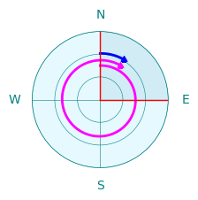
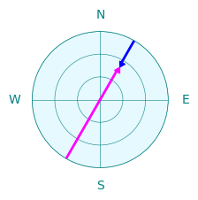

Note also that the rotation speed of G-5500DC is different in the horizontal and vertical planes. Here is what appears in its specifications:

```yaml
Rotation time (approx.): 
  Elevation (180°): 65 sec.
  Azimuth+(360°): 60 sec.
```

The SkyRoof algorithm assumes that vertical rotation is two times slower than horizontal.

## Algorithm

The SkyRoof algorithm that finds the optimum tracking strategy for the given satellite path is not rule-based, it uses the global optimizaton approach to find the optimal solution. The examples below show how it handles certain special cases.

---

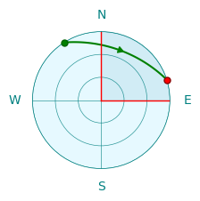

This is an easy case. The azimuth changes from 330° to 80°, so the rotation starts at 330° and, when the azimuth crosses 360°, continues in the same direction, up to 440°, which is the same direction as 80°.

---

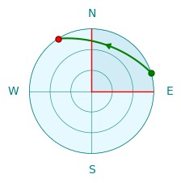

The same path, but in the opposite direction. The simple approach described above, that is used in many simple antenna rotation programs, no longer works. If we start at Azimuth=80°, we hit the 0° limit and cannot continue. The algorithm in SkyRoof looks at the whole pass and chooses to start at 440° instead of 80° so that the pass is tracked without interruption.

---

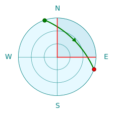

Now the path crosses both 0° and 450° lines. In this case the 90° overlap is not enough to ensure uninterrupted tracking. The dynamic algorithm still finds a solution: it uses the elevations > 90°. Tracking starts at (Az=170°, El=180°) and ends at (Az=280°, El=180°). Again, all azimuths are in the 0° - 360° range, ensuring uninterrupted tracking.

---

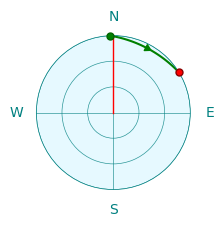

SkyRoof has a parameter in the rotator control settings that determines the steps in which the antenna is rotated, to prevent frequent starts and stops of the motors. Indeed, if the antenna beam width is, say, 60°, there is no point in rotating it in 1° steps. The default step size is 5°.

The path in the chart above crosses 360°, but it extends beyond the red line only by a couple of degrees. If the overshoot does not exceed the rotation step, the algorithm is smart enough to start the path at 0° so that 360° rotation is not required. This works even if the rotator does not have an extended azimuth range.

---

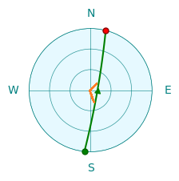

This is a high elevation pass. As we have seen before, it requires the antenna to make a fast rotation by about 180° in azimuth. The rotators that support elevations of 0° to 180° can use elevation > 90° for the second half of the path, thus eliminating the 180° azimuth change. However, to switch from the elevation < 90° to > 90°, the antenna must deviate from the path a little bit and pass through the zenith (90°), as shown with the orange lines in the chart above. Dynamic programming plans this deviation in an optimal way.

---

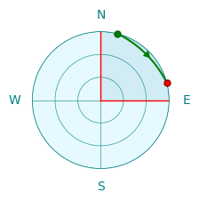

In many cases there is more than one way of tracking the same path. For example, the path above may be tracked in three different ways:

- (Az=20°, El=0°) -> (Az=70°, El=0°)
- (Az=380°, El=0°) -> (Az=430°, El=0°)
- (Az=200°, El=180°) -> (Az=250°, El=180°)

When the algorithm finds multiple optimum paths, it chooses the one which has the starting point closest to the current antenna direction.

---

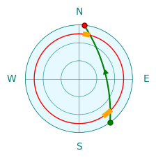

Some antenna rotators have a turning range that does not cover the whole upper hemisphere. The chart above shows the case where the rotator has an elevation range of 15° to 90°. This could be a limitation of the hardware or just an obstructed horizon that makes lower elevation angles useless. The algorithm obeys these restrictions, it does not go beyond the red line. It follows the path shown in the chart with orange lines.
