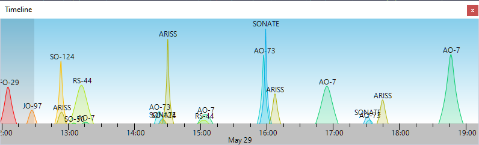

# Time Line

The TimeLine panel shows the satellite elevation chart as a function of time for all satellites in the selected group:

- Zoom in and out using the mouse wheel
- Pan by dragging the chart with your mouse
- Click on the satellite name to make it current, and to view the pass on the
    [Sky View panel](sky_view_panel.md).

The dark part of the chart represents the past time.
