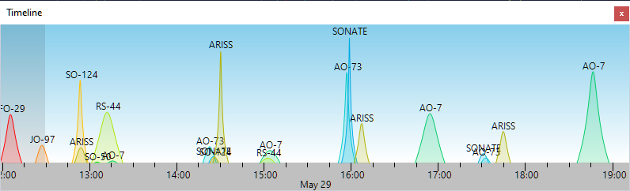

# Time Line

The TimeLine panel shows the satellite elevation chart as a function of time for all satellites in the selected group:

- Zoom in and out using the mouse wheel
- Pan by dragging the chart with your mouse
- Click on the satellite name to make it current, and to view the pass on the
    [Sky View panel](sky_view_panel.md).

The dark part of the chart represents the past time.

The time scale is drawn in the time zone selected on the [Clock](clock.md) widget. The date labels name
the mode as **(UTC)** or **(Local)**, and the marker in the top right corner of the panel shows **Z** or
**LT**.
