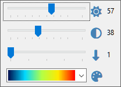

# Waterfall Display

## Using Waterfall Display

The waterfall display and associated
[Frequency Scale](frequency_scale.md)
is the central piece of SkyRoof that integrates most of the functions available in the application:

The waterfall spans over 3 MHz of spectrum (depending on the SDR model) so that it covers the whole
satellite segment, 435-438 MHz, on the 70 cm band. On the 2 m band the satellite segment is
only 200 kHz wide, 145.8-146 MHz, so it also fits completely in the waterfall.

- Zoom in and out using the mouse wheel
- Pan by dragging the waterfall horizontally with your mouse

A mouseclick on the waterfall display:

- tunes the SDR and external radio to a terrestrial signal
- or, if the frequency is within the transponder segment of a passing satellite, selects
    that satellite and sets the transponder offset to the clicked signal.

A click on the **Sliders** button in the top left corner of the panel opens
the sliders that adjust brightness, contrast and scrolling speed of the waterfall,
and select a color palette:

## See Also

- [Frequency Scale](frequency_scale.md)
- [Doppler Tracking](doppler_tracking.md)

## Waterfall Display Characteristics

Finding and tracking satellite signals on the VHF and UHF bands is a difficult task. These signals are weak
because the output power of most satellite transmiites is in the milliwatt range. The fact that
an omnidirectional antenna needs to be used to receive all in-range satellites at the same time makes this task
even more difficult. On top of that, we need to see the whole 3-MHz frequency segment where the satellite signals
may appear, and at the same time we want a very high resolution to examine the structure of the signals,
and to tune precisely to CW, SSB and digital transmissions.

The waterfall display in SkyRoof solves these problems by computing power spectra oversampled by a factor of about 100.
This has three important consequences:

1. You can zoom in the waterfall display without changing its resolution in Settings, just by spinning the mouse wheel.
    When zoomed in to the maximum, you can see the signals with a **100x** maginification (20 Hz resolution).

2. When zoomed out to the maxmimum to see the whole 3-MHz segment, the sensitivity of the waterfall display to
    narrowband signals improves by about **15 dB** due to oversampling.

3. Spectrum oversampling, however, increases the requirements to the hardware:
    - more CPU power is needed to compute very large spectra;
    - more texture memory is needed in the video card to store the spectra;
    - support of OpenGL 3.3 or higher is required for the zoom function.

    Please see the [System Requirements](system_requirements.md) section for the exact requirements.

If your computer does not meet these requirements, you can still use the pass prediction, Doppler correction,
radio control and rotator control functions in SkyRoof, just disable the SDR function and close the Waterfall
Display panel.
